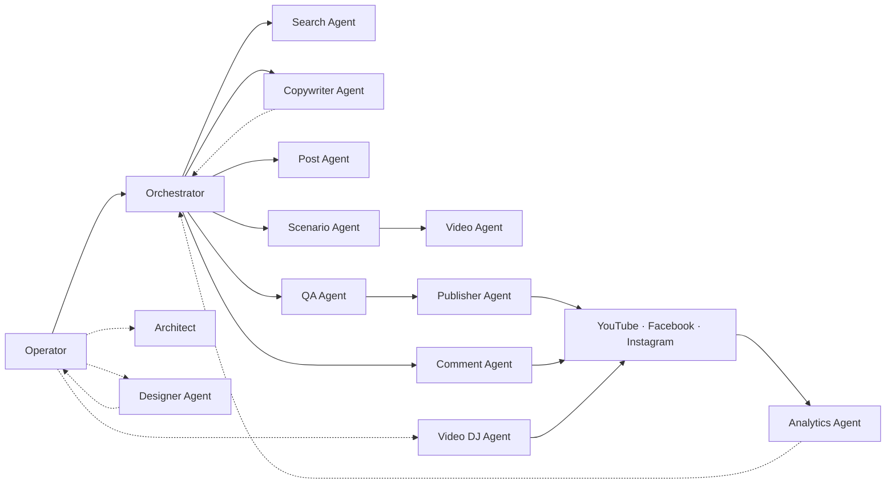

# MediaOps Platform

MediaOps Platform is an agent-driven operating system for producing,
validating, publishing, and managing social media content.

**Latest release: [v0.4.0](#releases) — Designer + Copywriter roles, long-form Type 1, closeout runner (2026-07-31)**

The project is designed to run with agent environments (Codex and Claude
Code currently supported). This repository contains the agent rules,
pipelines, runtime scripts, safe templates, and operator documentation. The
actual work is performed in the chosen agent environment with access to a
local workspace.

MediaOps is not only a content generator. It is a controlled production
workflow for:

- finding and preparing ideas;
- preparing post text, scripts, generated images, and video packages;
- assembling short-form videos;
- checking packages before publication;
- publishing or scheduling through supported platform APIs;
- reading back publication state;
- running controlled audience comment engagement cycles;
- archiving verified successful packages;
- keeping agent work reproducible through pipelines and task contracts.

The goal is to replace ad-hoc manual production with a structured agent system
where every role owns a clear part of the workflow and every handoff is backed
by files, reports, and rules.

## Why It Exists

MediaOps Platform is built for operators and small teams that produce content
regularly across multiple social platforms and want to:

- publish posts, Shorts, and Reels faster;
- reduce mistakes before API writes;
- repeat successful formats without rebuilding every step manually;
- split work between search, preparation, editing, QA, and publishing agents;
- keep routine audience replies accountable and logged;
- operate multiple platform accounts in the same system with per-account
  topic policy and per-destination routing;
- run locally or with an optional VPS worker;
- switch between agent environments (Codex / Claude Code) without losing
  project state;
- keep secrets, runtime configuration, and production artifacts outside the
  repository;
- move the system to another machine or operator without carrying private local
  state.

## Main Advantage

The main advantage of MediaOps Platform is flexibility. The system is not locked
to one niche, one content style, or one publishing route.

An operator can adapt it to their own topics, accounts, editing style, post
format, platforms, and production rules without rebuilding the whole codebase
from scratch.

It is not a bot for a single niche. It is an adjustable content production
factory: the operator can change the niche, visual style, sources, scenario
rules, publication route, and connected agents for each project.

## What Is Included

The repository includes:

- rules and pipeline files for all active agents;
- shared conventions for paths, contracts, states, and reports;
- approved runtime scripts for local and VPS execution;
- safe configuration templates;
- task-bus conventions;
- example task contracts;
- new-machine bootstrap logic;
- operator documentation;
- systemd examples for VPS services and timers;
- state schema and migration helpers.

Real work data, secrets, tokens, active runtime configuration, generated
packages, archives, VPN configs, and production state must live outside this
repository.

## System Requirements

### Supported Operating Systems

Primary local production target:

- Windows 10/11;
- PowerShell 7 for UTF-8 and Cyrillic-safe command output;
- Windows Task Scheduler for local delayed Instagram publishing;
- Windows OpenSSH client when VPS mode is used.

VPS mode:

- Linux VPS with systemd;
- recommended OS class: Ubuntu LTS or Debian stable;
- SSH access as a normal user;
- sudo/root access only for explicitly approved package, service, or system
  dependency changes.

Not primary production targets:

- macOS/Linux desktop may be used for repository review or partial development,
  but the current local production flow is Windows-oriented;
- WSL is not a replacement for Windows Task Scheduler in the local Instagram
  flow;
- mobile operating systems are not supported.

### Hardware

Minimum practical local setup:

- runs on CPU, with an optional GPU for acceleration;
- 16 GB RAM is a practical minimum for light workflows;
- 32 GB RAM or more is recommended for active video work;
- storage requirements depend on source video volume and archive retention, but
  tens or hundreds of GB are realistic for comfortable operation.

GPU acceleration is optional. If present, Architect should verify CUDA,
PyTorch, Florence-2, and any optional reframe tooling before enabling GPU mode.
Without a GPU, the system should continue through CPU mode and/or API fallback
where configured.

### Required Local Software

Baseline:

- An agent environment with file/shell access (Codex or Claude Code). Active
  production work, image generation, and long agent sessions may require a
  higher subscription tier;
- Git;
- Python 3.10+;
- PowerShell 7;
- FFmpeg and FFprobe;
- yt-dlp;
- the bundled Python dependencies;
- local work and archive folders;
- active runtime config based on a safe template;
- an external secrets and tokens folder outside the repository.

For video workflows:

- FFmpeg/FFprobe are required;
- yt-dlp is required for downloading source videos from supported URLs;
- PySceneDetect and the bundled video dependencies;
- optional Florence-2 dependencies when the local visual-alignment provider is
  used;
- faster-whisper is optional for local transcription;
- Node.js 20+ is optional for future Node/Remotion-like helpers.

For post workflows:

- the bundled post dependencies;
- image generation/processing access according to the active environment;
- WireGuard is optional when a VPN fallback is needed for source image
  retrieval.

For publishing:

- platform API credentials outside the repository;
- provider keys only for features the operator actually enables;
- API publishing can be disabled for platforms that should use manual-only
  publication.

### Required VPS Software

For VPS worker mode:

- Linux VPS with systemd;
- Python 3.10+;
- Git or a deployed copy of approved runtime scripts;
- SSH server;
- required server-side secrets;
- systemd service/timer for the Instagram worker and status/reporting services;
- minimal Telegram bot/status service when the operator wants operational
  status through Telegram;
- network access to Meta/Instagram API and Cloudflare R2;
- enough space for temporary plan, log, and state files.

FFmpeg on the VPS is required only for server-side tasks that actually process
media there. The current Instagram VPS flow primarily uses the server as a
worker for staged media, plan state, API publish, and verification.

If the VPS is later used for heavier video processing or ready-video streaming,
choose a stronger server than the minimal worker instance.

## Supported Platforms

Current focus:

- YouTube Shorts / video publishing flow;
- Facebook video publishing;
- Facebook photo and text posts;
- Instagram Reels through local Windows flow or VPS worker flow;
- Instagram feed posts through local Windows flow or VPS worker flow;
- audience comment engagement through enabled Comment Agent platform profiles.

The system already includes:

- local operation mode;
- minimal VPS worker support for delayed Instagram publishing;
- basic Telegram bot/status service support for operational state;
- R2 as temporary staging for the Instagram/VPS flow;
- read-back and sync-back after publishing;
- platform delete/reconciliation flow with explicit destructive confirmation.

Platforms are connected through runtime configuration. The repository must not
contain real account names, API tokens, OAuth secrets, public IDs, server IPs,
or private operator paths.

## How It Works

Core principles:

- pipeline is law: agents do not improvise outside their pipeline;
- task contracts: handoffs are written as machine-readable JSON contracts;
- role boundaries: every agent owns only its own part of the workflow;
- QA gate: ready packages are checked before Publisher when the execution mode
  requires it;
- explicit platform scope: Instagram and other platforms are not silently added
  by vague "all platforms" wording;
- runtime separation: the repository contains source rules and scripts, while
  production data lives in runtime, work, and archive roots.

## Project Maturity

MediaOps Platform is currently a private pre-release / production foundation.

Already available:

- baseline agent architecture;
- production pipelines for active roles;
- task-bus workflow;
- Facebook post/video flow;
- Post Agent profile-extension foundation;
- YouTube video flow;
- Instagram local/VPS foundation;
- Comment Agent base/profile engagement foundation;
- config-gated Analytics Agent performance feedback;
- config-gated Video DJ 24/7 streaming (encoder + watchdog + FB rolling lives);
- QA gate;
- release sanitization;
- bootstrap foundation;
- approved runtime scripts.

Practically, this means:

- the system can be used by an operator who understands the workflow;
- new operators should start with Architect bootstrap and dry-run checks;
- production publishing should not start before runtime config, credentials,
  and platform access are configured;
- integrations can be disabled or run manual-only when credentials or VPS are
  not configured.

## Releases

### v0.4.0 — Designer + Copywriter roles, long-form Type 1, closeout runner (2026-07-31)

- **Designer Agent (new role)** — video cover art as a dedicated role, on
  operator-requested contracts only: YouTube preview `16:9` and Shorts
  thumbnail `9:16`, with a binding HUD-plate text template, live-validated
  safe zones, its own contract factory, and a per-format config block. One
  variant per video, operator approval before the task closes.
- **Copywriter Agent + Type 4 Source-Cut (new role + video family)** — donor
  videos are mined into a state-DB topic registry (cut range, duration,
  narration-ready context brief); factory-built serve contracts feed those
  topics into a new Type 4 video family that cuts a segment from the source
  instead of assembling clips. Reused footage routes to Facebook and
  Instagram, never YouTube.
- **Long-form Type 1 (41s+)** — a distinct scenario method for longer
  verticals: multi-beat skeleton, montage deltas, a pre-TTS morphology and
  stress checklist, and TTS alignment that survives finalize and patch.
- **Search rework** — per-category candidate pools instead of one flat stack:
  a single freshness window per account, playlist-scoped search areas defined
  in operator config (never derived from a playlist description), pool modes
  with an off-list fallback, entry points for sections search engines do not
  index, and serve-time reachability checks. Serving draws only from
  pool-backed categories, so an interactive session never pays for broad
  discovery.
- **Deterministic archive closeout** — one runner replaces hand-written
  closeout: year/month/day archive layout, a publication-evidence gate that
  resolves platform IDs across every publisher report shape, in-process
  YouTube context backfill, byte-verified source-to-dest moves, and empty
  shell cleanup. Plus a workspace janitor and a contact-sheet runner.
- **Subject-lock reframe** — a `16:9` to `9:16` reframer that holds one scale
  per clip with a locked subject X, replacing the unstable external tool on
  the default vertical path.
- **Image generation governance** — provider routing is fixed per artifact
  class and dispatched by environment; configuration values are read at the
  moment of the call rather than cached for a session; every generation
  writes the parameters actually sent next to the config they resolved from,
  so metered spend is visible in the artifacts instead of the monthly bill.
- **Safety and contract hardening** — a factory now refuses to invent a
  timezone (a missing one is a blocker, not a silent UTC drift); branding can
  no longer shorten the narration tail; release-slot keys carry the conflict
  family rather than the finer platform token; post packages enumerate in one
  binding shape; cancelled slots delete their local files immediately.
- **Pre-release rule review** — an independent read-only pass over the whole
  rule set closed 74 findings (6 of them behaviour-changing conflicts) and
  synchronised operator documentation with the shipped feature set.

### v0.3.0 — Video DJ Agent + publish-now (2026-07-02)

- **Video DJ Agent (new role)** — a config-gated, out-of-band 24/7 streaming
  operator: drives a deployed server-side streaming engine (encoder + watchdog +
  Facebook rolling supervisor) over YouTube continuous and Facebook
  rolling/one-shot lives. Adds its own pipeline, queue convention, three
  approved runtime engines, systemd examples, and an operator doc.
- **Publish-now (immediate publication)** — publish a ready package immediately
  on YouTube, Facebook video, Instagram Reels, and Instagram feed
  (`publication_mode = immediate`, slot `now`): no schedule, no durable plan,
  no VPS worker; Instagram runs a synchronous one-pass path.
- **Instagram failed-slot recovery** — immediate republish handoff for missed
  slots plus an R2 staging cleanup tool (verified deletes + DB resolution
  states) and a closeout rule that mirrors the resolution into both plan copies.
- **Media-ops bot resolution states** — recovered slots stop pinning
  `/instagram` and `/pending` as "Needs attention"; only genuinely unresolved
  failures stay flagged.
- **record-manual-youtube** — Publisher recovery mode symmetric with
  record-manual-facebook: verifies an operator-uploaded YouTube video via API
  read-back and records it into publishing state.
- **Slot-cancellation propagation** — a shared cancellation convention;
  factories drop operator-cancelled slots from every downstream contract and
  annul all-cancelled contracts.
- **Facebook comment grounding** — published FB videos/reels are recorded into
  a state table so Comment Agent grounds replies on the real subject.
- **Consistency + de-leak sweep** — execution-mode default clarified
  (`balanced` with a config override), metadata-schema doc parity with the
  actual producer shape, retired pre-split files removed.

### v0.2.0 — Analytics Agent + search rewrite (2026-06-26)

- **Analytics Agent (new role)** — a config-gated, out-of-band agent that reads
  published-content performance (views, retention, engagement) across
  YouTube/Facebook/Instagram and surfaces evidence-backed, per-frame causal
  feedback to producers (second -> beat -> frame -> why). Adds its own pipeline,
  convention, runtime collectors, state tables, and an optional Google-Sheets
  export (off by default). Advisory only — never a publication gate.
- **Search rewrite** — enforced source-domain diversity, two-pass discovery, and
  a per-account `search.enabled` toggle to skip a destination from auto-search.
- **Instagram Reels archive-reuse backlog driver** — schedule the oldest
  unpublished archived Reels across N days from one command (account-parametric,
  Reels-only, gate markers never fabricated).
- **Scenario/Orchestrator validation gates** — deterministic narration-text gate,
  pre-factory spec-link validation (cross-slot + reference-not-in-source),
  grammatical-form check before applying TTS stress, and mandatory
  stranded-contract reconciliation.
- **Factory fixes** — Type 2 sources downloaded as H.264 at 1080p or below;
  `creative_only` allowed for profile-backed evergreen fact cards.
- **Repository hygiene** — the repository holds only working, implemented agents;
  design drafts, plans, and R&D move to local handoff, not the repo.

### v0.1.2 — Scenario/Video Agent split (2026-06-19)

- **Scenario/Video Agent split** — the former video edit agent is split into a
  Scenario Agent (text: source understanding, narration, ElevenLabs TTS +
  alignment, metadata; no clips, no vision) and a Video Agent (editor and sole
  vision owner: scene detection, contact sheets, clip map, cut, framing/reframe,
  audio mix, render). Narration (Gate 1) and audio (Gate 2) are Scenario-owned;
  final video (Gate 3) is Video-owned.
- **Factory is the single source of contracts** — drift is a blocker.
- **Type 2 reference-remake matcher** rebuilt on local CLIP content-matching.
- **Scale-to-fit vertical reframe** backend; vertical Shorts/Reels floor 12-15s.
- **CRLF eliminated at the source**; montage-type-aware handoff validation.
- **Free image-generation recovery** before any paid fallback.

### v0.1.1 — Multi-account video publishing (2026-06-12)

- **Multi-account video** — one machine runs several brands/accounts. The
  account is resolved from the destination; one contract = one account
  (credential isolation). Per-account YouTube channel + token (with a
  pre-upload channel assert so a video never lands on the wrong channel),
  Facebook page, YouTube title hashtag suffix, playlist map, and branding.
- **Account-first archive layout** (`<alias>/<date>`); shared post run
  artifacts kept separate.
- **Per-account default music track and TTS voice** (global when unset).
- **New "publish operator-supplied finished video" contract**
  (`operator_final`) — provide a ready local mp4 plus slot/platforms; the
  agent prepares metadata and publishes, with no montage or voiceover.
- **Fast mode** — publish without a separate QA agent, via an Orchestrator
  inline preflight.
- **Intent-based approval gates** (platform-content deletion stays strict).

### v0.1.0 (2026-06-08)

- Initial release: generic core, new-machine onboarding setup-driver,
  production-secret protocol.

## Repository Structure

- `AGENTS.md` - common rules for all agents.
- `pipelines/` - source-of-truth workflow files for agent roles.
- `conventions/` - shared path, state, contract, and reporting conventions.
- `rules/` - specialized shared rules.
- `policies/` - repository-wide technical and dependency policies.
- `checklists/` - production-scoped checklists referenced by role pipelines.
- `runtime/approved/` - approved runtime scripts that may be deployed into the
  active runtime folder.
- `runtime/assets/` - bundled runtime resources (fonts, etc.).
- `runtime/systemd/examples/` - VPS service and timer examples.
- `settings/` - safe configuration templates.
- `examples/` - task contract, environment, and toolchain examples.
- `requirements/` - Python dependency manifests.
- `readMe/` - operator documentation.
- `docs/architecture/` - design notes, migration notes, and future ideas.
- `state/` - safe state schema/templates (canonical state DB schema).
- `tools/` - development or migration helper tools.

`readMe/` helps the human operator, but it does not replace the pipelines. For
agents, the source of truth remains `AGENTS.md`, the role pipeline, the task
contract, and the active runtime config.

## Configuration Model

MediaOps separates repository source from active runtime.

In the repository:

- rules;
- pipeline files;
- templates;
- approved runtime scripts;
- documentation;
- safe examples.

In active runtime:

- the active runtime configuration;
- real work/archive paths;
- real destination mappings;
- task bus;
- generated packages;
- logs/state/reports;
- deployed runtime scripts.

In archive/secrets:

- API credentials;
- OAuth tokens;
- R2 credentials;
- provider keys;
- historical published packages;
- durable state.

This separation lets the same repository release be deployed on another machine
or for another operator without carrying private accounts, IPs, tokens, or local
paths.

## Deployment Modes

### Local Only

The operator works on a Windows machine. This is suitable for content
preparation, manual control, and publications that do not need an autonomous
server-side worker.

### Local + API Publishing

Content is prepared locally. Publisher Agent uses platform API credentials for
publishing or scheduling. This requires correctly configured external
secrets/tokens.

### Local + Windows Scheduler

Used for local delayed Instagram flow. Windows Task Scheduler is a trigger-only
mechanism and does not replace Publisher or Orchestrator logic.

### Local + VPS Worker

The local machine prepares plans and staging. The VPS worker handles delayed
Instagram publishing, verification, and cleanup. A sync-back task returns the
final state to local runtime.

In the current foundation version, VPS support already includes the minimal
working contour: Instagram worker, status/reporting service, and a Telegram
bot/status interface for operational control. Heavier server-side scenarios,
such as streaming or publishing ready videos to YouTube and Facebook through a
VPS worker, are roadmap items.

### Manual-Only Publishing

If API publishing is not needed or credentials are not configured, the system
can prepare publish-ready packages while the operator publishes manually. The
Publisher Agent for that platform can be disabled or limited.

## Agents

### Architect

Architect owns architecture, pipelines, approved runtime scripts, operator
documentation, release preparation, and safety of changes.

It can:

- assess new functionality for risk, cost, and production impact;
- change pipelines and repository source of truth;
- prepare bootstrap/new-machine flows;
- fix approved runtime scripts;
- run readiness/smoke checks;
- prepare release and distribution repository work;
- keep secrets and local operator values out of the repository.

Architect must not run production publishing, recovery, archive, VPS changes,
sync, or sudo/root work without explicit operator instruction.

### Orchestrator Agent

Orchestrator owns the production route.

It can:

- turn operator requests into agent tasks;
- choose the required agents;
- create task contracts;
- track gate transitions;
- return packages for narrow fixes after QA failure;
- prepare Publisher-ready handoffs;
- close successful packages through archive flow.

Orchestrator should not do specialized agent work itself.

### Search Agent

Search Agent owns default post/news discovery. Operator-specific discovery
workflows are separate, stored outside the repository under the runtime work
root.

It can:

- find news and articles for post production;
- prepare readable candidate lists;
- check basic source quality;
- update search/news cache through approved runtime paths;
- stop safely when a custom Search Agent has no bound discovery profile.

Search Agent does not publish and does not modify runtime settings. Custom
profiles are runtime extensions created by Architect on operator request, not
default repository roles.

### Post Agent

Post Agent owns Facebook photo and text post packages. It ships with a default
news-post format; optional operator-specific preparation formats are stored
outside the repository under the runtime work root.

It can:

- prepare final post text;
- generate images for posts through connected AI services;
- use and process source visuals when the workflow requires them;
- apply readable text overlays;
- run text preflight before image generation, including semantic review,
  morphology, stress marks, abbreviations, numbers, and pronunciation risks;
- prepare a package for QA/Publisher;
- follow hashtag, overlay, and publication metadata rules.
- stop safely when a profile-backed task has no bound extension.

The result is a ready post package, not the publication itself.

### Scenario Agent

Scenario Agent owns the text and voice side of video content: it understands the
source and writes the narration. It produces no clips and does no vision work.

It can:

- understand the source (title, description, transcript, web) before writing;
- write the narration text and get approval (Gate 1);
- generate the ElevenLabs voiceover and alignment, and get audio approval (Gate 2);
- prepare video package metadata;
- for Type 2 Reference Remake: transcribe the reference and adapt the Russian
  narration;
- for Type 3 Revoice: transcribe the source and adapt a Russian voiceover for an
  existing video while keeping its visual.

Scenario Agent does not select clips, cut, frame, or render — that is the Video
Agent's responsibility.

### Video Agent

Video Agent owns editing and final render, and is the sole owner of vision work.

It can:

- run scene detection and build contact sheets;
- select clips and build the clip map (said = shown), and cut the clips;
- frame/reframe (including scale-to-fit vertical);
- mix the approved narration audio with the cut video;
- add music, branding, and final visual elements;
- check duration, framing, readability, and metadata cleanup;
- present the rendered candidate for final review (Gate 3) and prepare the final
  video package for QA/Publisher.

For Type 2, Video Agent assembles a near-remake from the reference match map
(local CLIP content-matching) rather than turning the task into free montage.

Supported video montage types:

- Type 1 Manual - the operator does the final montage from the prepared clip
  package; agents stop at package preparation.
- Type 1 Automontage - a short video assembled by Video Agent from the prepared
  clips and edit map around approved narration, with vertical framing, music,
  branding, and final render.
- Type 2 Reference Remake - a new video built from the structure and pacing of a
  reference video, replacing its visual sequence with the operator's own sources
  (reference frames are never reused).
- Type 3 Revoice - an existing video re-voiced with new Russian narration
  (original audio replaced, visual kept); routed to Facebook video and Instagram
  Reels only, not YouTube.

### QA Agent

QA Agent owns package validation before publication.

It can:

- validate machine-readable contracts;
- check required artifacts;
- check package metadata and routing;
- catch blockers before Publisher;
- check between agents in deep mode;
- run pre-Publisher QA in balanced mode;
- return a pass result or a narrow blocker list.

QA Agent should not run heavy media operations unnecessarily and should not
replace the editor or montage agent.

### Publisher Agent

Publisher Agent owns publication, scheduling, and read-back.

It can:

- validate Publisher task contracts;
- publish or schedule through supported runtime scripts;
- perform platform API verification;
- work with Facebook video/photo posts;
- work with YouTube video flow;
- work with Instagram local/VPS flow;
- write reports;
- refuse destructive platform actions without explicit confirmation.

Publisher Agent should not patch production packages in place when that would
violate the pipeline. On blocker, it reports and stops.

### Comment Agent

Comment Agent owns routine audience engagement for supported comment platforms.

The role is split into:

- shared Comment Agent base rules for scan, de-duplication, reply selection,
  moderation vocabulary, and reports;
- platform profiles that provide API-specific fetch, auth, state, and
  moderation mappings.

Current executable platform profiles:

- YouTube comments for operator-owned channels.
- Facebook Page comments for operator-owned Pages.

Active runtime config controls participation per account and platform. A
platform profile that is disabled, missing, or unsupported must block before
API calls.

It can:

- fetch recent comments through a supported platform profile;
- compare fetched comments against local state;
- reply to useful comments when the task contract allows automatic replies;
- match reply language to the comment language when clear;
- record comment and action state in the local database;
- report moderation candidates;
- run hard-rule comment-level moderation only when explicitly enabled per
  destination in the active runtime config. Author bans are a separate opt-in
  policy only when a platform profile supports them.

Comment Agent does not publish videos, schedule content, change metadata, pin
comments, archive packages, touch VPS/R2 state, or edit repository files.

### Analytics Agent

Analytics Agent owns optional, config-gated performance feedback. It runs out of
band like Comment Agent: no task contracts, never in the production task chain,
and active only when `analytics.enabled` for the account.

It can:

- read published-content performance (views, retention, engagement) for matured
  videos through the platform analytics APIs;
- run a causal review (second -> beat -> frame -> why) with a counterexample
  check, supporting evidence, and a confidence level;
- write advisory findings to the local state database and an optional
  Google-Sheets export (off by default);
- surface a consumption playbook that producers read as findings, not as new
  gates.

Analytics Agent is advisory only: it never publishes, schedules, deletes, edits
pipelines, changes metadata, or creates hard blockers.

### Video DJ Agent

Video DJ Agent owns optional, config-gated 24/7 streaming. It runs out of band
like Comment Agent: no task contracts, never in the production task chain, and
active only when `streaming.enabled` for the account.

It can:

- drive a deployed server-side streaming engine (encoder + watchdog + Facebook
  rolling supervisor) via service commands — YouTube continuous and Facebook
  rolling/one-shot lives;
- manage playlists and stream queues through a shared queue convention,
  including operator-remembered playlists;
- collect stream titles/descriptions from the operator when going live;
- report stream health and rollovers.

Video DJ Agent never provisions infrastructure and never re-implements the
streaming engine: the VPS lifecycle belongs to Architect, and the engine is
approved runtime deployed to the server. Music/content rights are entirely the
operator's responsibility.

## Features

### Posts

- Facebook photo and text post package preparation;
- image generation for post visuals;
- text overlays;
- Facebook hashtags;
- QA before publishing;
- publication through the approved runtime publisher.

### Text Preparation

- morphological and editorial preflight before image generation, scripts, and
  narration;
- stress-mark and pronunciation-risk checks;
- simplification of complex technical identifiers when that reduces TTS risk;
- preserving normal spelling for brands, models, and common names when TTS
  handles them correctly;
- preparing text so image, narration, and publication caption work as one
  package.

### Video

- Shorts/Reels production workflow;
- multiple montage types;
- TTS/narration handling;
- source maps;
- clip plans;
- reframe/crop;
- metadata cleanup before publishing;
- YouTube/Facebook/Instagram routing;
- immediate publication (publish-now) on every platform in scope — no
  schedule, no durable plan, no VPS worker.

MediaOps helps organize and assemble videos, but it does not guarantee the same
quality for every niche. Final quality depends on source materials, topic
complexity, editing style, available hardware, connected APIs/providers, and
how well the operator adapts the rules to the niche.

### Instagram VPS Flow

- durable Instagram publish plan preparation;
- media staging to R2;
- deferred VPS worker publication;
- sync-back after slots;
- wake-up driver through the approved helper;
- protection against treating a pending JSON file as a real monitor;
- failed-slot recovery: immediate republish handoff plus verified R2 staging
  cleanup with DB resolution states, so recovered slots stop flagging as
  failures on status surfaces.

### VPS And Telegram Operations

- minimal VPS worker support for Instagram flow;
- server-side status/reporting service;
- Telegram bot/status interface for viewing plan and task state;
- sync-back from VPS state into local runtime;
- optional 24/7 streaming services (encoder + watchdog + FB rolling
  supervisor) driven by the Video DJ agent;
- foundation for future server-side workflows.

### Comment Engagement

- shared Comment Agent base convention plus platform profiles;
- scheduled cycles for enabled comment profiles with local de-duplication by
  comment ID;
- automatic replies when the task contract allows them;
- report-only moderation by default; auto-moderation for exact comments is
  per-destination and gated by explicit operator authorization stored in the
  active runtime config;
- durable local records for scan runs, threads, comments, and actions;
- language-aware replies without exposing internal pipeline details;
- current executable profiles: YouTube comments and Facebook Page comments;
  additional platform profiles require Architect implementation before use.

### Operations

- task bus;
- completed/failed reports;
- archive closeout;
- environment doctor;
- clean-machine bootstrap;
- optional VPS services;
- Telegram/status bot support through runtime tools.

## Task Lifecycle

Typical production flow:

1. The operator gives a task to Orchestrator.
2. Orchestrator defines the format, platforms, execution mode, and required
   agents.
3. Search Agent finds sources or topics when needed.
4. Post Agent prepares the post package; for video, Scenario Agent prepares the
   narration text, voiceover, and metadata.
5. Video Agent edits and assembles the final video when the task is video-based.
6. QA Agent checks package, metadata, and contracts.
7. Orchestrator creates a Publisher task only after QA passes or an explicit
   fast-mode QA skip is authorized.
8. Publisher Agent publishes or schedules and writes a report.
9. Orchestrator closes and archives the successful package after the required
   verification.

Comment cycles are separate engagement closeouts. They can be scheduled by
Orchestrator or Architect after publication, but they are not a publication gate
and must not change video metadata or archive state.

When a blocker appears, the agent writes a report and returns the task for a
narrow fix. The system should not invent success or publish before the required
gate.

## Execution Modes

- `balanced` - default mode for normal production work.
- `fast` - only when explicitly selected by the operator and only with explicit
  QA-skip authorization where relevant.
- `deep` - stronger verification for complex tasks, failures, recovery, or when
  the operator requests deep validation.

## Readiness Checklist

Before production work:

- Architect initialization;
- environment doctor;
- config validation;
- toolchain validation;
- secrets/tokens presence check without printing values;
- role-specific readiness for needed agents;
- dry-run or test package without publishing;
- explicit platform scope before the first publication.

For release/distribution work:

- leak scan for real accounts, IPs, local paths, and secrets;
- JSON template validation;
- Python compile for approved runtime scripts;
- sync-back contract dry-run when Instagram VPS flow is enabled;
- README/operator documentation review;
- check that active runtime config was not committed.

## Local Mode And VPS Mode

Local mode is suitable when the operator:

- wants to control publication manually;
- uses Windows Task Scheduler;
- does not want to maintain a server;
- works with platforms where local execution is enough.

VPS mode is useful when the operator:

- wants autonomous delayed Instagram publications;
- wants R2 staging;
- plans to run a stable background worker;
- wants status/sync-back without manually watching every slot;
- may later need heavier server-side workflows.

If the VPS will be used for ready-video processing or streaming, choose a
stronger server than the minimal worker setup.

## What This Project Does Not Do

MediaOps is not:

- a SaaS web dashboard out of the box;
- a fully autonomous system without an operator;
- a way to bypass platform rules;
- a guarantee of monetization;
- protection against account blocks, copyright claims, or API policy changes;
- a secret storage system;
- a universal non-linear video editor;
- a replacement for human judgment in difficult niches where taste, editing,
  and manual review matter.

The system reduces routine and mistakes, but the operator remains responsible
for platform scope, rights to materials, publication quality, and platform
policy compliance.

## Costs And External Services

Actual cost depends on enabled integrations.

Potential paid components:

- VPS;
- Cloudflare R2 or another object storage provider;
- OpenAI/API providers;
- ElevenLabs or another TTS provider;
- video generation providers;
- paid VPN;
- paid proxies or extra tools;
- platform developer/business verification costs where applicable.

Before a new feature is enabled, Architect should assess:

- API support;
- permissions;
- direct and indirect cost;
- production-flow impact;
- secret safety;
- maintenance complexity;
- rollback plan.

## Roadmap

The platform evolves like a content operating system:

- **Niche-specific Scenario Agent** — niche scripts and donor-video flow for long sources.
- **Codex SDK / Claude Agent SDK integration** — agents coordinate automatically: the operator sets a task and gets the result.
- **Telegram as a new publication destination** alongside YouTube, Facebook, Instagram.
- **Own VPS streaming service** — an agent runs YouTube and Facebook live broadcasts from pre-prepared playlists, without a local machine.
- **Cloud Central State** — shared state in an external database (Cloudflare D1 or VPS) to work from several computers at once.

## Security

The repository must not contain:

- API tokens;
- OAuth secrets;
- real `.env` files;
- private VPN profiles;
- real server IPs;
- private SSH paths;
- public account names when they are used as runtime routing;
- production package state;
- active platform IDs tied to a specific operator.

Sensitive values belong in active runtime config, external secret folders, or
platform provider storage outside the repository.

## License

MediaOps Platform is distributed under a private commercial source-available
license.

Authorized operators may use and modify the system for their own internal
content operations. Redistribution, resale, public publishing, sublicensing,
sharing repository access, or offering MediaOps as a competing hosted service is
not permitted without written permission from the project owner.

The software is provided without warranty. Operators are responsible for their
own platform accounts, content rights, credentials, API usage, costs, and
compliance with platform policies.
